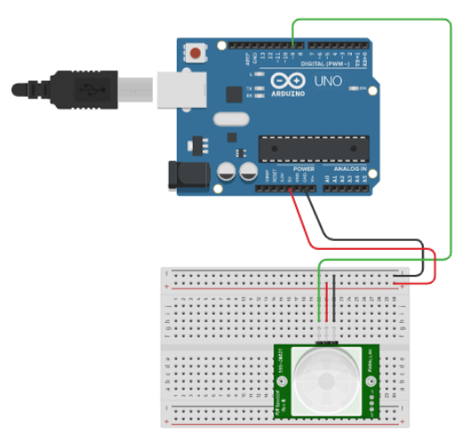

# Arduino and a Motion Sensor

A basic example of reacting to the status of a motion sensor using an Arduino and the built-in LED.

## Arduino Code

Open up [Arduino Create](https://create.arduino.cc/editor/) and add the following code:

```csharp
// Define a variable to store the pin number
int motionPin = 2;

// The setup function runs once when you press reset or power the board
void setup(){

  Serial.begin(9600);
  pinMode(motionPin, INPUT);

  pinMode(LED_BUILTIN, OUTPUT);

}

// The loop function runs over and over again forever
void loop (){

  // Add a delay between each loop
  delay(1000);

  // Fetch the current motion sensor status
  int motionResult = digitalRead(motionPin);

  // Output the current motion sensor result
  Serial.println(motionResult);

  // Turn the bulit-in LED on or off based on the motino sensor status
  if (motionResult == HIGH) {
    digitalWrite(LED_BUILTIN, HIGH);
  } else {
    digitalWrite(LED_BUILTIN, LOW);
  }

}
```

> [View the Arduino code on Arduino Create](https://create.arduino.cc/editor/professoradam/67d42c97-02ab-4f79-9f4b-fd4c3e68fd5c/preview)

You will need to setup the following circuit using your Arduino:



> [View the Circuit on Tinkercad](https://www.tinkercad.com/things/jDkGCF2jfv1)

> Full tutorial URL:  
> https://codeadam.ca/learning/arduino-motion-sensor.html

***

## Repo Resources

- [Arduino Create](https://create.arduino.cc/editor)

<br>
<a href="https://codeadam.ca">

</a>
